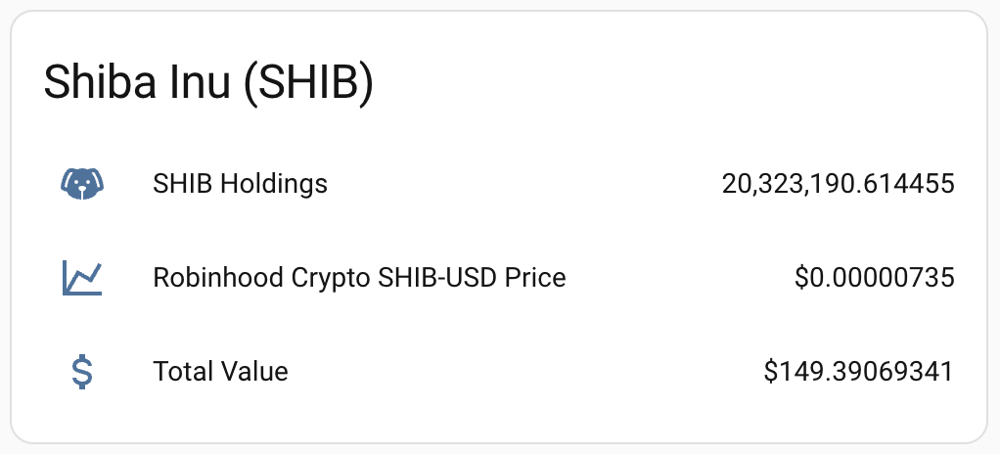

# Robinhood Crypto Home Assistant Integration

This custom integration lets you surface Robinhood Crypto Trading API data inside Home Assistant and place/cancel orders via services. It signs requests exactly as described in the [Robinhood Crypto Trading docs](https://docs.robinhood.com/crypto/trading/#section/Introduction), using your API key and Ed25519 private key.

## Features
- Sensors for account status and buying power
- Sensors per holding (quantity and available to trade)
- Price sensors for configured trading pairs (midpoint of best bid/ask)
- Admin services to place or cancel orders

## Setup
1. In Home Assistant, copy the `custom_components/robinhood_crypto` folder into your `config/custom_components/` directory and restart.
2. Add the integration via **Settings → Devices & Services → Add Integration → Robinhood Crypto**.
3. Provide:
   - `API key`: value from the Crypto Credentials portal.
   - `Private key (base64)`: base64-encoded Ed25519 private key seed generated per the docs.
   - `Symbols`: comma-separated trading pairs to monitor (e.g. `BTC-USD,ETH-USD`). Leave blank to fetch all.
4. Adjust polling intervals and symbols later in the integration’s **Options**.
5. To create/regenerate your API key and pair it with your public key, visit the [Crypto Account Settings](https://robinhood.com/account/crypto) page in a desktop browser. Enter your base64 public key when creating credentials, then copy the API key into the integration setup screen above.

### HACS installation
After this repo is published, you can add it as a custom repository in HACS:
1. HACS → Integrations → ⋮ → Custom repositories → add this repo URL as category “Integration”.
2. Install “Robinhood Crypto”, restart Home Assistant, then add the integration via **Settings → Devices & Services**.

### Example (SHIB price and value)


### Key generation (OpenSSL)
If you prefer OpenSSL instead of Python, you can generate the Ed25519 keypair and base64 strings like this:

```sh
# Generate Ed25519 key
openssl genpkey -algorithm ED25519 -out ed25519-key.pem

# Base64 private (seed) – use this in the integration
openssl pkey -in ed25519-key.pem -outform DER | tail -c 32 | base64

# Base64 public – provide to Robinhood when creating API credentials
openssl pkey -in ed25519-key.pem -pubout -outform DER | tail -c 32 | base64
```

### Services
- `robinhood_crypto.place_order` (admin only): Submit market, limit, stop_loss, or stop_limit orders.
  - Required: `symbol`, `side` (`buy`/`sell`), `order_type`.
  - Optional: `client_order_id` (UUID if omitted), `asset_quantity`, `quote_amount`, `limit_price`, `stop_price`, `time_in_force` (`gtc` default), `entry_id` when multiple accounts exist.
- `robinhood_crypto.cancel_order` (admin only): Cancel by `order_id` (with optional `entry_id`).

## Notes
- Headers are signed as `x-api-key + x-timestamp + path(+query) + method + body` using Ed25519, per the official examples (via `cryptography`—no extra requirements to install).
- Timestamps are generated on each request; server-side validity is 30 seconds.
- Default polling: account/holdings every 60s, prices every 30s. Options allow 15–600s and 5–300s respectively to respect the API’s 100 rpm limit.
- New holdings discovered after setup will require reloading the integration to add sensors.

## Development
- Requirements are specified in `custom_components/robinhood_crypto/manifest.json` (PyNaCl for signing).
- Services are documented in `custom_components/robinhood_crypto/services.yaml`.

## Contributions

Come see our other apps and integrations at [WeaveHub](https://weavehub.app).